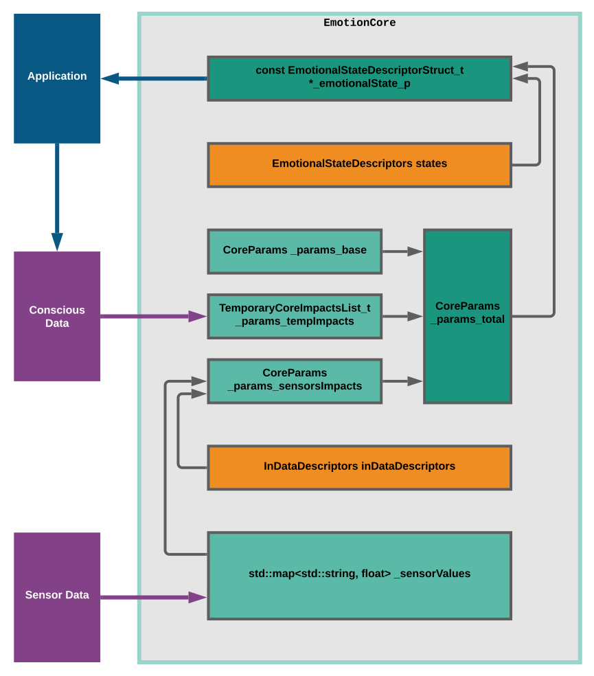

# The Emotion Core

Part of the [R.Giskard project](https://github.com/an-dr/r_giskard)

The aim of this library is to implement an emotion model that could be used by other applications implementing behavior modifications (emotions) based on changing input data.

The Core has sets of **parameters**, **states** and **descriptors**:

**Parameters** define the **state** of the core. Each state has a unique name (happy, sad, etc.) **Descriptors** specify the effect caused by input data to the parameters. The user can use either the state or the set of parameters as output data. Those effects can be:

- depending on sensor data
- depending on time (temporary impacts)

## Build

The repository uses CMake meta-build system and consists of four targets. Each target is defined in a separated cmake-file.

Libraries:

- libAnimalEmotionCore.a ([cmake/AnimalEmotionCore.cmake](cmake/AnimalEmotionCore.cmake))
- libGenericEmotionCore.a ([cmake/GenericEmotionCore.cmake](cmake/GenericEmotionCore.cmake))

Binaries:

- Example_AnimalEmotionCore ([examples/AnimalEmotionCore/CMakeLists.txt](examples/AnimalEmotionCore/CMakeLists.txt))
- Example_GenericEmotionCore ([examples/GenericEmotionCore/main.cpp](examples/GenericEmotionCore/main.cpp))

For development is used [Visual Studio Code](https://code.visualstudio.com/) (`r_giskard_EmotionCore.code-workspace`)

## Usage

Examples:

- [GenericEmotionCore](examples/GenericEmotionCore/main.cpp)
- [AnimalEmotionCore](examples/AnimalEmotionCore/main.cpp)

If you are using CMake, just import a .cmake file from the `cmake` folder into your CMakeLists.txt.

For other systems, use sources and headers from `include` and `src` folders

## Library descriptions

### GenericEmotionCore

The GenericEmotionCore library - it is an empty core. To work with it developer should specify its own parameters, states and descriptors. (see [the example](examples/GenericEmotionCore/main.cpp))

### AnimalEmotionCore

This core is based on the generic one and aims to implement a simple model of the mammal's endocrine system in the part responsible for emotional state.

It contains six parameters:

- `adrenaline`
- `cortisol`
- `dopamine`
- `melatonin`
- `oxytocin`
- `serotonin`

And four conditions (work in progress, hence useless for now):

- `happiness, joy`
- `sadness, grief`
- `anger, rage`
- `fear, anxiety`

(see [the code](src/AnimalEmotionCore/AnimalEmotionCore.cpp) and [the example](examples/AnimalEmotionCore/main.cpp))


## Details

### Structure

The core consists of:

- Input Data Descriptors - describes data from sensors and how it should affect the core
- Emotional States Descriptors - named states of the core described by specific values of core parameters.
- Sensor values
- Parameters: base, temporary, sensorial (calculated from values and input data descriptors), and total (a sum of others)

Detailed structure:



### Content examples

Example of core parameters:

```json
[   "cortisol",
    "dopamine",
    "adrenaline",
    "serotonin" ]
```

Example of a core's Emotional state:

```json
{
    "name": "happiness",
    "conditions": [
            {
                "param":  "cortisol",
                "op":     LESS_THAN,
                "value":  10
            },
            {
                "param":  "serotonin",
                "op":     GREATER_THAN,
                "value":  100
            }
        ]
}
```

Example of input data descriptor:

```json
{
    "sensor_name": "temperature sensor",
    "val_min": 0,
    "val_max": 255,
    "weights": [
        {
            "core_param_name": "serotonin",
            "weight": 0.5
        },
        {
            "core_param_name": "cortisol",
            "weight": -0.5
        }
    ]
}
```

Input data example:

```json
{
    "sensor_name": "temperature sensor",
    "value": 120
}
```

Temporary impact example (say, something like a "bad thought"):

```json
{
    "change_per_sec" : 5,
    "param_name" : "cortisol",
    "delta_value" : 50
}
```

### Writing new data

When you write the data, the core does the following:

- updates saved sensor value
- updates core parameter: `param += (new_sens_val - old_sens_val) * weight`
- updates the current core state based on updated parameters
